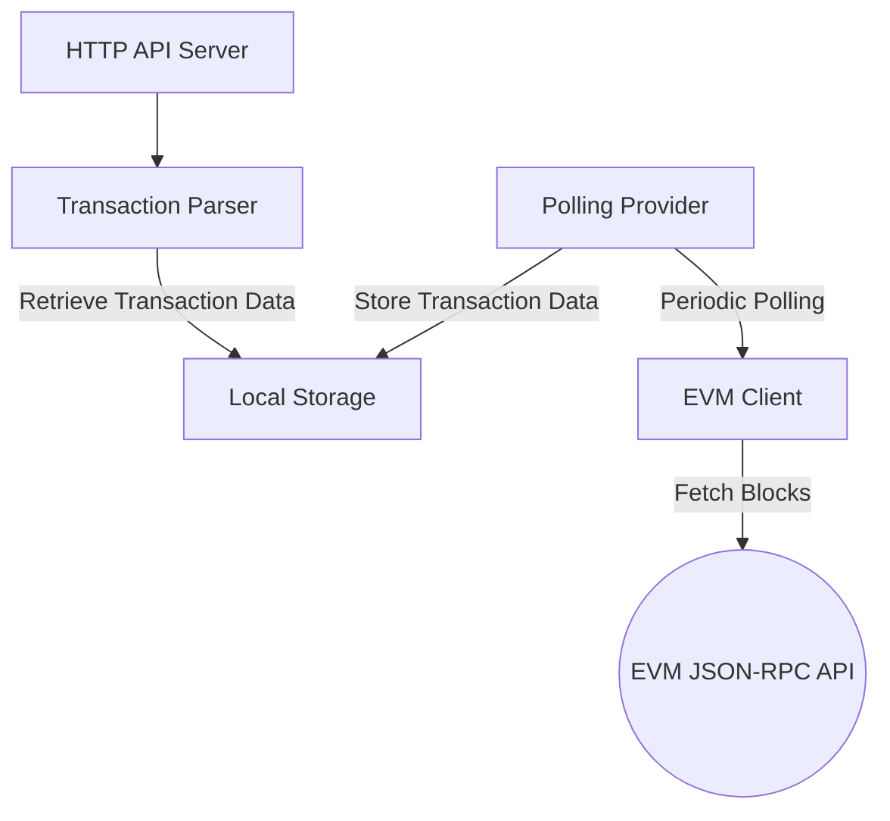

# Ethereum Transaction Parser

## Overview

This project is a lightweight Ethereum blockchain transaction parser designed to track and notify about transactions for subscribed addresses. It provides a robust solution for parsing blockchain data with support for block polling, local in-memory storage, and a flexible API interface.

It can be ran on every network that supports the [Ethereum JSON RPC Interface](https://ethereum.org/en/developers/docs/apis/json-rpc/).

## Requirements

<p align="center">
  
</p>

## Features

- Real-time Ethereum transaction tracking
- Address subscription management
- In-memory transaction storage
- Blockchain reorganization handling
- RESTful API for interaction

## Solution Architecture



### Key Components
- **API**: HTTP endpoints for interaction
- **Parser**: Transaction tracking and subscription management
- **Storage**: In-memory local storage with reorg handling
- **Provider**: Periodic block polling mechanism
- **Client**: EVM JSON-RPC client for blockchain interaction

#### Blockchain Interaction
- Uses the Ethereum JSON-RPC API for blockchain data retrieval and can be ran on any network supporting it
- Handles blockchain reorganizations (reorgs), up to a configurable depth limit

#### Storage Mechanism
- In-memory storage with a configurable block limit
- Tracks transactions for subscribed addresses
- Automatically prunes old blocks based on reorg depth

#### Polling Mechanism
- Periodic block checking based on a configurable average block time
- Detects and handles:
  - New blocks and transactions
  - Blockchain reorganizations (reorgs), up to a configurable depth limit

## API Endpoints

### 1. Get Current Block
- **URL**: `/blocks`
- **Method**: `GET`
- **Response**:
  - Success: `200 OK`
    ```json
    {
      "result": <block_number>
    }
    ```
  - Error: `500 Internal Server Error` or `503 Service Unavailable`

### 2. Manage Subscriptions
#### Subscribe to an Address
- **URL**: `/subscriptions`
- **Method**: `POST`
- **Request Body**:
  ```json
  {
    "address": "<ethereum_address>"
  }
  ```
- **Response**:
  - Success: `201 Created`
  - Error: 
    - `400 Bad Request`
    - `409 Conflict`
    - `500 Internal Server Error`

#### Unsubscribe from an Address
- **URL**: `/subscriptions`
- **Method**: `DELETE`
- **Request Body**:
  ```json
  {
    "address": "<ethereum_address>"
  }
  ```
- **Response**:
  - Success: `204 No Content`
  - Error: `500 Internal Server Error`

### 3. Get Transactions
- **URL**: `/transactions`
- **Method**: `GET`
- **Query Parameter**: `address`
- **Response**:
  - Success: `200 OK`
  ```json
  {
    "result": [
        {
            "from": "0xabc123...",
            "to": "0xdef456...",
            "hash": "0x789ghi..."
        },
        {
            "from": "0xaaa111...",
            "to": "0xbbb222...",
            "hash": "0xccc333..."
        }
    ]
  }
  ```
  - Error: `500 Internal Server Error`

## Project Structure

```
tx-parser/
│
├── api/           # HTTP API handlers
├── client/        # Blockchain RPC client
├── cmd/           # Entry point for the application
├── config/        # Configuration management
├── errors/        # Custom error types
├── provider/      # Block polling mechanism
│   ├── polling-provider/    # Current polling implementation
│   └── stream-provider/     # Future streaming provider (placeholder)
├── storage/       # Transaction storage
│   ├── local-storage/       # Current in-memory storage
│   └── redis-storage/       # Future Redis storage (placeholder)
├── tx-parser/     # Core transaction parsing logic
└── types/         # Data structures
```

## Prerequisites

- Go 1.20+
- Ethereum JSON-RPC endpoint (or any other EVM network)
- `.env` file with configuration

## Example Configuration

Create a `.env` file with the following variables:
```
EVM_RPC_URL=https://ethereum-rpc.publicnode.com
SERVER_ADDR=:8080
AVG_BLOCK_TIME=12s
REORG_DEPTH_LIMIT=32
```

## Running the Project

1. Clone the repository
2. Install dependencies:
   ```bash
   go mod vendor
   ```
3. Set up `.env` file
4. Run the application:
   ```bash
   go run cmd/main.go
   ```

## Testing

To run tests:
```bash
go test ./...
```

## Future Improvements

### Streaming Block Provider
- Aims to replace polling mechanism with more efficient real-time updates
- Potential improvements over polling block provider:
  - Reduced latency - push vs pull strategy
  - Lower resource consumption
  - More responsive transaction tracking

### Redis Storage
- Potential improvements over in-memory storage:
  - Data persistence
  - Better scalability
  - Configurable eviction policies
  - Can be shared across multiple instances of the application

## Disclaimer

This is a homework project and is not intended for production use without significant enhancements.
